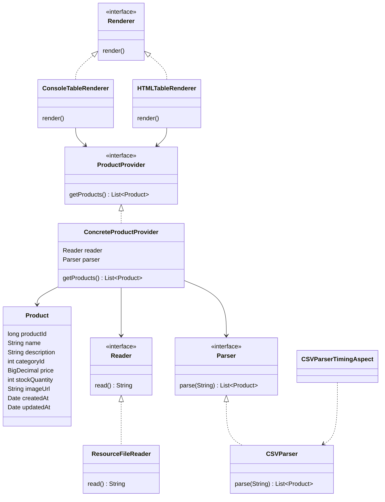

\# Лабораторная работа №2

\*\*Конфигурирование приложение Spring c помощью аннотаций. Применение AOП для логирования\*\*

\## Цель работы 

Целью лабораторной работы является изучение:

\- конфигурирования Spring-приложения с помощью аннотаций;

\- внедрения зависимостей;

\- использования конфигурационного файла;

\- жизненного цикла бинов;

\- аспектно-ориентированного программирования (АОП);

\- расширяемости архитектуры за счёт интерфейсов.

---

\## Описание приложения

Приложение представляет собой консольное Spring-приложение, которое:

\- загружает данные о товарах из CSV-файла;

\- парсит CSV в список объектов `Product`;

\- измеряет время парсинга с помощью AOP;

\- выводит результат в HTML-файл в виде таблицы;

\- использует события жизненного цикла бина для логирования момента инициализации.

---

\## Структура проекта

les04/lab

└── app

├── src/main/java/ru/bsuedu/cad/lab

│ ├── aop

│ │ └── CSVParserTimingAspect.java

│ ├── model

│ │ └── Product.java

│ ├── parser

│ │ ├── Parser.java

│ │ └── CSVParser.java

│ ├── provider

│ │ ├── ProductProvider.java

│ │ └── ConcreteProductProvider.java

│ ├── reader

│ │ ├── Reader.java

│ │ └── ResourceFileReader.java

│ ├── renderer

│ │ ├── Renderer.java

│ │ ├── ConsoleTableRenderer.java

│ │ └── HTMLTableRenderer.java

│ └── AppWithSpringJava.java

└── src/main/resources

├── application.properties

└── products.csv

---

## UML-диаграмма классов

\## Вывод

В ходе выполнения лабораторной работы были изучены и применены:

\- внедрение зависимостей с использованием аннотаций Spring;

\- конфигурирование приложения через файл application.properties;

\- события жизненного цикла бинов для отслеживания момента инициализации;

\- аспектно-ориентированное программирование (AOP) для замера времени выполнения парсинга;

\- расширяемая архитектура с использованием интерфейсов и нескольких реализаций.

Все требования лабораторной работы выполнены, приложение корректно запускается и демонстрирует ожидаемое поведение.

